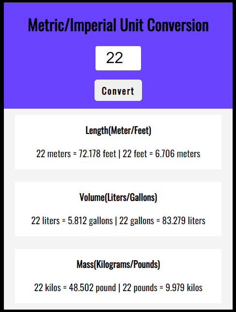

# Unit Convertor
 
## Table of Content

 * [Overview of the Project](#overview-of-the-project)
      * [Goal of the project](#goal-of-the-project)
      * [Screenshot](#screenshot)
 * [Technologies I Used](#technologies-i-used)
 * [Acknowledgment](#acknowledgment)

# Overview of the Project
The goal of the project is to create a unit conversion app to convert values like meter to feet, volume to gallon and kilos to pound. Its is a solo project in which I have coded everything from scratch which helped me improve my skills.

### Goal of the Project
* The Goal of this project is to convert certain unit values like meter to feet, volume to gallon and kilos to pound.
* To style the project with HTML and CSS.
* To add a input box where the value you want the conversion for will be added.
* To add a convert button so when the button is clicked the values will be converted.

## Screenshot

## Technologies I Used
* Semantic HTML5
* CSS
* Javascript

## Acknowledgment
This is a solution to a solo project on Scrimba. Solo Project helps you code everything from scratch which helps to improve coding skills.
